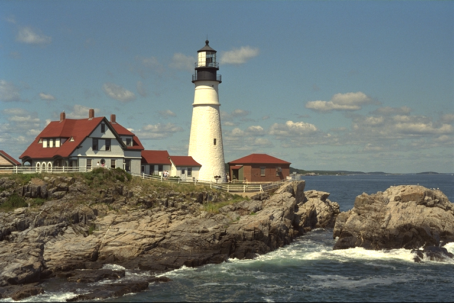
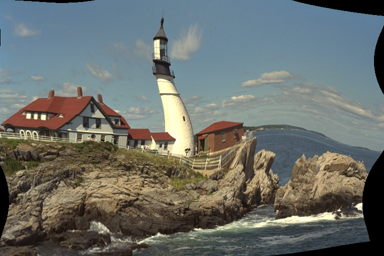

# RegisterDeformation

This package represents spatial deformations, sometimes also called diffeomorphisms or warps.
Under a deformation, a rectangular grid might change into something like this:


A deformation (or warp) of space is represented by a function `ϕ(x)`.
For an image, the warped version of the image is specified by "looking
up" the pixel value at a location `ϕ(x) = x + u(x)`.  `u(x)` thus
expresses the displacement, in pixels, at position `x`.  Note that a
constant deformation, `u(x) = x0`, corresponds to a shift of the
*coordinates* by `x0`, and therefore a shift of the *image* in the
opposite direction.

Currently this package supports just one kind of deformation, one defined
on a rectangular grid of `u` values.
The package is designed for the case where the number of positions in the `u`
grid is much smaller than the number of pixels in your image.
Between grid points, the deformation can be defined by interpolation.
There are two "flavors" of such deformations, "naive" (constructed directly from a `u` array) and "interpolating" (one that has been prepared for interpolation).
You can prepare a "naive" deformation for interpolation with `ϕi = interpolate(ϕ)`;
be aware that `ϕi.u ≠ ϕ.u` even though they represent the same deformation,
because the interpolation prefilter modifies the coefficients.

You can obtain a summary of the major functions in this package with
`?RegisterDeformation`.

## Demo

Let's load an image for testing:

```
using RegisterDeformation, TestImages
img = testimage("lighthouse")
```

```@meta
DocTestSetup = quote
    using RegisterDeformation, TestImages
    img = testimage("lighthouse")
end
```

Now we create a deformation over the span of the image:

```jldoctest demo
# Create a deformation with a fixed (non-random) displacement field
gridsize = (5, 5)
# Each column of u is a 2D displacement vector; here we use a simple
# linear ramp so results are deterministic
u = [Float64(5*(i-1) - 10) for xy in 1:2, i in 1:5, j in 1:5]
# The nodes specify the location of each value in the `u` array
# relative to the image that we want to warp. This choice spans
# the entire image.
nodes = map(axes(img), gridsize) do ax, g
    range(first(ax), stop=last(ax), length=g)
end
ϕ = GridDeformation(u, nodes)

# output

5×5 GridDeformation{Float64} over a domain 1.0..512.0×1.0..768.0
```

This is a "naive" deformation, so we can't evaluate it at an arbitrary position:

```jldoctest demo
julia> ϕ(3.2, 1.4)
ERROR: call `ϕi = interpolate(ϕ)` and use `ϕi` for evaluating the deformation.
[...]
```

But it works if we create the corresponding interpolating deformation:

```jldoctest demo
julia> ϕi = interpolate(ϕ)
Interpolating 5×5 GridDeformation{Float64} over a domain 1.0..512.0×1.0..768.0

julia> length(ϕi(3.2, 1.4))
2
```

Now let's use this to warp the image (note it's more efficient to use `ϕi` here,
but `warp` will call `interpolate` for you if necessary):

```jldoctest demo
imgw = warp(img, ϕ)
axes(imgw)

# output

(Base.OneTo(512), Base.OneTo(768))
```

You might get results somewhat like these:

| Original | Warped |
| -------- | ------ |
|  |  |

The black pixels near the edge represent locations where the deformation `ϕ`
returned a location that lies beyond the edge of the original image.
The corresponding output pixels are marked with `NaN` values.

```@meta
DocTestSetup = nothing
```
